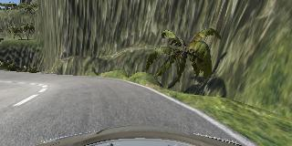
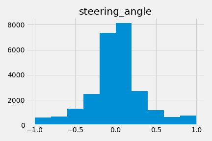
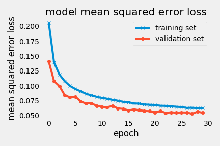
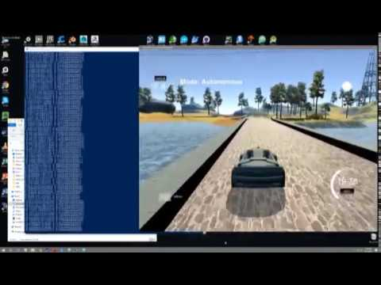

# Behavioral Cloning
## Galen Ballew, 2017
---

This repository contains the scripts necessary to generate a working model for a autonomous vehicle via a simulator built in Unity3D. The repo does not contain the images used for training the data. I wrote a more in-depth article about the process on [Medium](https://medium.com/@galen.ballew/).

---
### Gathering data
The first step in the process was to gather data. The simulator includes a Training Mode which takes snapshots from virtual camera on the left, center, and right side of the car's dash. My training data consisted of **25,781** observations, each with 3 different frames, steering angle, throttle, brake, and speed values.  

  <center>
  <figure>
  
  <figcaption>Fig1. - A sample frame from the center camera.</figcaption>
  </figure>
  </center>


I gathered my data using the following protocol:
  1. 1 lap driven clockwise
  2. 1 lap driven counter-clockwise
  3. 1 lap driven in "recovery"

Driving in recovery meant that I only recorded the portion of driving when the car was on the outside of the lane and needed to re-center. Portions where the car was driving away from the center were not recorded because we do not want the model to learn that behavior.

This protocol was completed once for each of the two different tracks available in the simulator.

Once the data was collected, I took a quick look at the distribution of steering angles.

<center>
<figure>
  
<figcaption>Fig2. - Very high kurtosis distribution of steering angles.</figcaption>
</figure>
</center>

It's very clear that for the large majority of the time, there are very small steering adjustments being applied. This means that the model will learn to apply small steering adjustments most of the time which can be both good and bad. It's good to continue driving straight if the car is centered in the lane (and the lane is straight), but bad if the car is headed off of the road and needs to correct. It's up to the convolutional neural network to make a decision on when to enact the less common but higher valued steering angles.

---
### Bootstrapping

DNNs thrive on large datasets due to the problem of vanishing gradients. In order to increase my already large dataset, I simply flipped images on the y-axis and multiplied their steering angle by -1. This was a quick and easy way to double the size of my training set. Some additional ways to bootstrap:

  1. Perspective transform to birdseye view  
  2. Slight, random skews and warps of images  
  3. Random shadows added  

If these approaches where to be taken, it may serve to have multiple models with the final output being an ensemble method.

---
### Data Augmentation

Transforming the raw images, and thus the feature space/dimensions was a very important part of my project. Originally, I had created a model that used the images as they were produced by the camera - very large and in RGB. While there is _a lot_ of information stored in those images, the number of model parameters needed to extract and hold that information was in the millions. Not to mention the model took hours and hours to train. So, in order to make the project a more iterative process, I **reduced the size of my images by a factor of 10**. Further, I converted the images to **HSV colorspace** and only passed the **Saturation channel** to the model. This reduced the number of parameters in my model by orders of magnitude and dramatically increased training and prediction times. There are some other ideas for further data augmentation:

  1. Edge detection  
  2. Adding lane offset feature by combining from [Adv Lane Detection and Vehicle Tracking](https://github.com/galenballew/SDC-Lane-and-Vehicle-Detection-Tracking)

---
### Preprocessing

Per usual, all pixel data was normalized and standardized. This was done in the first layer of the CNN via a Lambda function.

---
### CNN Training
The model architecture:

```python
model = Sequential([
        Lambda(lambda x: x/127.5 - 1.,input_shape=(img_rows,img_cols,1)),
        Conv2D(12, 3, input_shape=(img_rows,img_cols,1), activation='relu'),
        MaxPooling2D((2,2)),
        Conv2D(24, 3, input_shape=(img_rows,img_cols,1), activation='relu'),
        MaxPooling2D((2,2)),
        Dropout(0.25),
        Flatten(),
        Dense(100, activation='relu'),
        Dense(50, activation='relu'),
        Dense(1)
    ])
```
This model architecture was the product of trial and error. Originally I had a very large network with millions of parameters, then I simplified to a network with as few at 63 parameters. What I found with the small network was that it trained very, very quickly, but it lacked the complexity/depth to hold all of the information I wanted it to. For example, if the car had been crashing at a certain spot, I would go to that spot in training mode and do some recovery driving. Without enough complexity in the model to **retain** that information, the recovery driving had no effect or would make the model crash somewhere else in the track. My final model contains **36,737** trainable parameters.

For training, I used the **Adam** optimizer in order to converge quickly (compared to SGD) with a **learning rate** of `1e-03`. For the loss function, I used **Mean Squared Error** in order to penalize large deviances from the target. The model trained quickly and efficiently with a decreasing validation loss in every epoch.

<center>
<figure>

<figcaption>Fig3. - Training and validation loss over 30 epochs.</figcaption>
</figure>
</center>

---
### Results

My model successfully drives around both tracks indefinitely! [Click here](https://www.youtube.com/watch?v=hDXkNExg3KE) to watch it perform on both tracks.  
<center>
<figure>

</figure>
</center>
